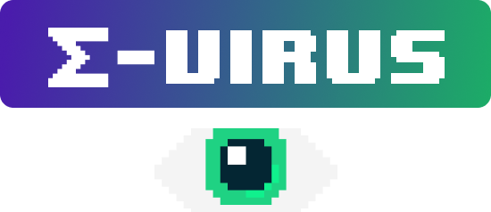

<p align="center">
  

  
  
  <a href="https://github.com/grochavieira/sigma-virus/commits/master">
    
  </a>
    
   
</p>

<h1 align="center">
    
</h1>

<h4 align="center"> 
	:tada:  Aplicação finalizada :tada:
</h4>

## 🏁 Tópicos

<p>
 👉<a href="#-sobre-o-projeto" style="text-decoration: none; "> Sobre</a> <br/>
👉<a href="#-funcionalidades" style="text-decoration: none; "> Funcionalidades</a> <br/>
👉<a href="#-layout" style="text-decoration: none"> Layout</a> <br/>
👉<a href="#-como-executar-o-projeto" style="text-decoration: none"> Como executar</a> <br/>
👉<a href="#-tecnologias" style="text-decoration: none"> Tecnologias</a> <br/>
👉<a href="#-autores" style="text-decoration: none"> Autores</a> <br/>
👉<a href="#user-content--licença" style="text-decoration: none"> Licença</a>

</p>

## 💻 Sobre o projeto

Projeto final da matéria de desenvolvimento de jogos digitais

---

<a name="-funcionalidades"></a>

## ⚙️ Funcionalidades

- [x] Menu para iniciar o jogo;
- [x] Jogador:
  - [x] Animação feita por sprites (de acordo com o seu movimento);
  - [x] Aceleração ao correr;
  - [x] Pode pular;
  - [x] Consegue atirar:
    - [x] 5 tiros de uma vez (só consegue atirar mais se algum dos outros 5 desaparecerem);
    - [x] O tiro desaparece a uma certa distância.
  - [x] Tem sistema de vidas:
    - [x] Perde uma ao tocar nos inimigos;
    - [x] Morre se cair em um abismo.
- [x] Inimigos:
  - [x] animação feita por sprite (de acordo com o seu movimento);
  - [x] IA Básica:
    - [x] Se movimenta de um lado para o outros;
    - [x] Se estiver a uma certa distância x e y do jogador,começa a segui-lo.
  - [x] O tipo de inimigo 3 é o único capaz de pular.
- [x] Score:
  - [x] 100 pontos a cada acerto de tiro nos inimigos;
  - [x] (100 \* vida do inimigo) a cada inimigo derrotado.
- [x] Mapa do Jogo:
  - [x] Foi produzido com tiles (bloquinhos);
  - [x] 5 mapas;
  - [x] Ao fim de cada mapa o jogador passa para a próxima fase;
  - [x] Foi criado uma colisão entre o jogador e inimigos com os tiles.
- [x] Câmera:
  - [x] A câmera segue o jogador;
  - [x] Câmera na posição x e y.
- [x] Tela ao perder o jogo;
- [x] Tela ao passar de fase.

---

## 🎨 Layout

---

## 🚀 Como executar o projeto

### Pré-requisitos

Antes de começar, você vai precisar ter instalado em sua máquina a última versão do python e também
é necessário instalar o pygame.
Além disto é bom ter um editor para trabalhar com o código como [VSCode](https://code.visualstudio.com/)

#### 🧭 Rodando o jogo

```bash

# Clone este repositório
$ git clone https://github.com/grochavieira/sigma-virus.git

# Acesse a pasta do projeto no seu terminal/cmd
$ cd sigma-virus

# Acesse a pasta game
$ cd game

# Execute a aplicação
$ python main.py


```

---

## 🛠 Tecnologias

As seguintes ferramentas foram usadas na construção do projeto:

**Jogo** ([Python](https://www.python.org/) + [PyGame](https://www.pygame.org/news))

#### **Utilitários**

- Editor: **[Visual Studio Code](https://code.visualstudio.com/)**

---

<a name="-autores"></a>

## 🦸‍♂️ **Autores**

<table align="center" width="100%">
  <tr align="center">
    <td>
      
      <br />
      <sub><strong>🌟 Guilherme Rocha Vieira 🌟</strong></sub>
      </p>
    </td>
    <td>
      
      <br />
      <sub><strong>🌟 Thomas Anderson 🌟</strong></sub>
      </p>
    </td>
    <td>
      
      <br />
      <sub><strong>🔥 Victor Masumoto 🔥</strong></sub>
      </p>
    </td>
  </tr>

</table>

---

## 📝 Licença

Este projeto esta sobe a licença [MIT](./LICENSE).

---
